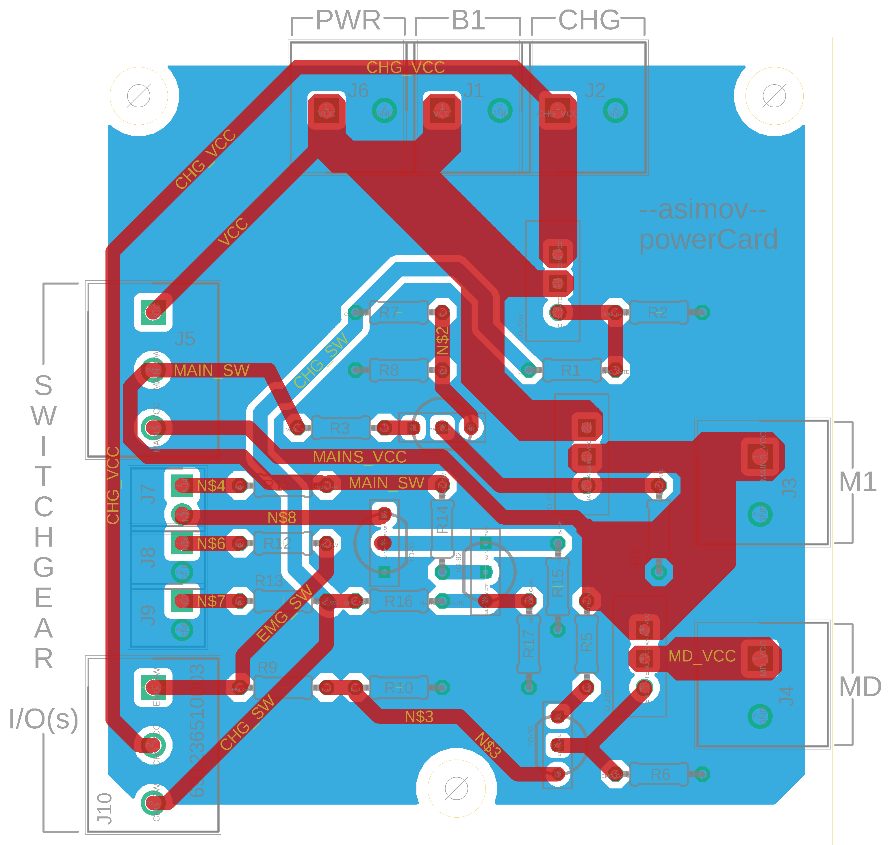

## Power Card for Asimov

### Power Ports
|Port         |Functionality |Description                                               |
|-------------|:------------:|:---------------------------------------------------------|
|J1: B1       |INPUT         |Battery Power Port                                        |
|J2: CHG      |INPUT         |Charging Power Port                                       |
|J3: M1       |OUTPUT        |MAINS Power Port (enabled by MAIN Switch)                 |
|J4: MD       |OUTPUT        |Motor Driver Power Port (disabled by EMG Switch)          |
|J6: PWR      |OUTPUT        |Battery Power Port (direct)                               |

### Switches IO
|Port  |Functionality |Description |
|------|:------------:|:------------------------------------------|
|J5  :1|OUTPUT        |VCC (for MAIN Switch)                      |
|J5  :2|INPUT         |MAIN Switch (disabled if CHG Switch==ON)       |
|J5  :3|OUTPUT        |MAINS VCC (for EMG Switch)                 |
|||
|J10 :1|INPUT         |EMG Switch (disables port J4: MD)          |
|J10 :2|OUTPUT        |CHG VCC (for CHG Switch)                   |
|J10 :3|INPUT         |CHG Switch (disabled if CHG not plugged IN)|

### Indcators
|Port           |Signifies                            |Description |
|---------------|:------------------------------------|:-------------------------------------|
|J7 : MAINS IND |MAINS(J3: M1) enabled                |-|
|J8 : EMG IND   |Drive Emergency --> (J4 :MD disabled)|-|
|J9 : CHG IND   |Charging enabledn (CHG plugged IN)   |MAINS & MAINS IND disabled, J1,J2,&J6 active|
